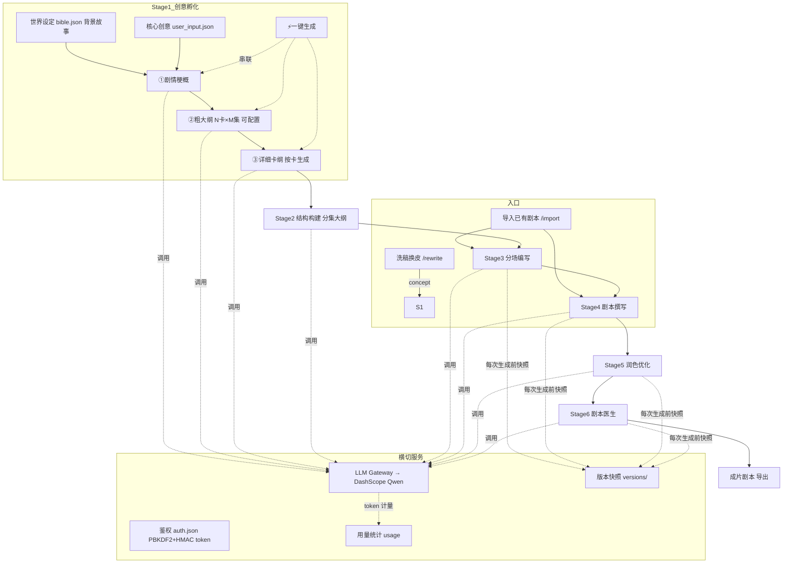
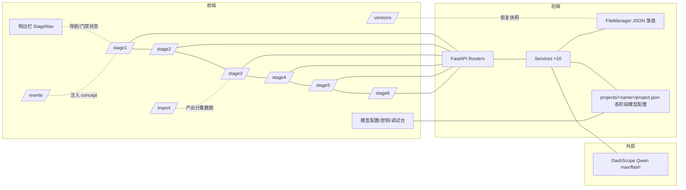

# 剧本工厂（Script Factory AI）— 用户旅程 · 数据流转 · 架构图

> 更新：2026-09-03。面向海外短剧（35-40 集为主）的 AI 剧本创作工作站。
> 技术栈：FastAPI（backend/）+ Next.js 16/React 19（frontend/），项目数据落盘于 `backend/projects/<项目名>/`。

---

## 一、用户旅程（User Journey）

### 旅程 A：从零创作（标准六阶段流水线）

| # | 阶段 | 页面 | 用户做什么 | 产出 |
|---|------|------|-----------|------|
| 0 | 准备 | /login → / | 登录（用户 sx）、新建/选择项目 | 空项目目录 |
| 1 | 创意孵化 | /stage1 | ① 填核心创意（可 AI 润色）② 生成剧情梗概 ③ 生成粗大纲（**卡数/每卡集数自由设置**，默认 8卡×10集；海外本常用 4卡×10集=40集）④ 逐卡生成详细卡纲 ⑤ 可选：填世界设定（Story Bible） | `1_ideas/story_bible.json`、`user_input.json`、`bible.json` |
| 2 | 结构构建 | /stage2 | 按卡/故事单元批量生成分集大纲，可逐条精修 | `2_structure/detailed_outlines.json` |
| 3 | 分场编写 | /stage3 | 按批次（每批 3 集）把大纲拆成场次 | `3_scripts/episode_outlines.json` |
| 4 | 剧本撰写 | /stage4 | 逐集生成对白/动作正文 | `4_screenplay/ep_*.json` |
| 5 | 润色优化 | /stage5 | AI 打磨语言、节奏、爽点密度 | `5_polish/` |
| 6 | 剧本医生 | /stage6 | 诊断逻辑漏洞/节奏问题并修复 | `6_doctor/` |

快捷路径：Stage 1 顶部 **⚡一键生成全部** —— 依据「背景故事」（世界设定 + 核心创意）一次跑完 ①→④，全程自动保存。

### 旅程 B：洗稿换皮（有参考剧本时）

| # | 页面 | 用户做什么 | 产出 |
|---|------|-----------|------|
| 1 | /rewrite | 粘贴参考剧本 → 提炼核心（故事线/卖点/看点/情绪钩子/人物原型/节奏结构） | `1_ideas/rewrite.json` |
| 2 | /rewrite | 填换皮方向（新题材/背景/风格）→ 生成全新故事概念 + 卖点对应表 | 同上 |
| 3 | /rewrite → /stage1 | 复制概念，进入旅程 A 继续六阶段流水线 | — |

### 旅程 C：已有剧本导入

/import 上传 txt/docx → 解析分集分场 → 进入对应阶段继续润色/诊断。

---

## 二、数据流转（Data Flow）

### 2.1 一次「生成」请求的数据路径

```
浏览器(页面组件)
  → fetchAPI(): 注入 Bearer token (localStorage sf_token)
  → Next.js rewrite  /api/* → BACKEND_PROXY_URL (服务器 8101 / 本地 8000)
  → FastAPI auth 中间件 (校验 HMAC token，失败 401 → 前端清 token 跳 /login)
  → Router (api/routers/*)  参数校验(Pydantic)
  → Service (services/*)   组装 Prompt(Jinja2) + DTG 理论文档
  → LLM Gateway (utils/llm_gateway.py) → DashScope Qwen (OpenAI 兼容协议, json_object/schema)
  → 结果规范化 + JSON Schema 校验 → FileManager 落盘 JSON → 返回前端渲染
```

### 2.2 项目目录数据契约（核心文件）

```
projects/<name>/
├── project.json              # 项目元信息 + 各阶段模型配置
├── 1_ideas/
│   ├── user_input.json       # 核心创意 + 大纲配置(card_count/episodes_per_card)
│   ├── story_bible.json      # synopsis / rough_skeleton / detailed_cards
│   ├── bible.json            # 世界设定(世界观/主线/人物/关系) = 「背景故事」
│   └── rewrite.json          # 洗稿: analysis + generated
├── 2_structure/detailed_outlines.json   # 分集大纲(ep_id 唯一, upsert 合并)
├── 3_scripts/episode_outlines.json      # 分场大纲
├── 4_screenplay/ep_*.json               # 剧本正文
├── 5_polish/  6_doctor/                 # 下游阶段产物
└── versions/                            # 自动快照(保留30个)
```

关键流转关系（下游只读上游）：
- `user_input.concept` + `bible.json` → 梗概生成的输入
- `story_bible.detailed_cards[].story_units[].episodes`（如 "11-15"）→ Stage 2 生成的分组依据与集数边界
- `2_structure/detailed_outlines.json` → Stage 3 的分场上限（总集数动态推导）
- Stage N 完成 → Stage N+1 的门禁（未完成上游时提示「去 Stage N」）

---

## 三、架构图

### 3.1 有向图（DAG）：生成流水线（数据只能向下游流动）



要点：**严格单向（有向无环）**——每阶段只消费上游落盘的 JSON，不回写上游；回退修改上游后，下游需手动重生成（版本快照可恢复）。

### 3.2 无向图（关联/依赖关系图）



无向关联说明：Stage 页面之间是**平级导航关系**（侧边栏可任意跳转，门禁仅是提示不是硬锁）；`rewrite`/`import`/`versions`/`settings` 与流水线为**辅助关联**，通过落盘文件与模型配置间接影响各阶段。

### 3.3 部署拓扑（服务器 118.178.142.2）

```
外网 ──► nginx :8100 ─ /  → Next.js :3100 (llm-sf-frontend, systemd)
                      └ /api → uvicorn 127.0.0.1:8101 (llm-sf-backend, systemd)
直连 ──► http://118.178.142.2:3000 已让给 ai-novel（另一项目）
本机 ──► 前端 127.0.0.1:3010，后端 127.0.0.1:8000
```

> 代码更新流程：本地 commit → push GitHub origin；服务器 `git pull`（GitHub 不可达时用 `git push server main` + `git reset --hard`）→ `rm -rf frontend/.next && BACKEND_PROXY_URL=http://127.0.0.1:8101 npm run build` → `sudo systemctl restart llm-sf-backend llm-sf-frontend`。
